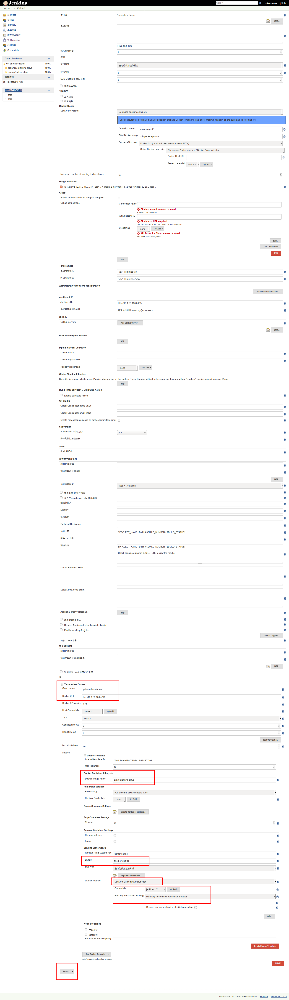
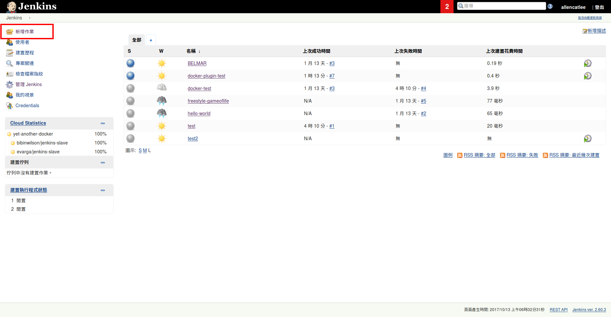
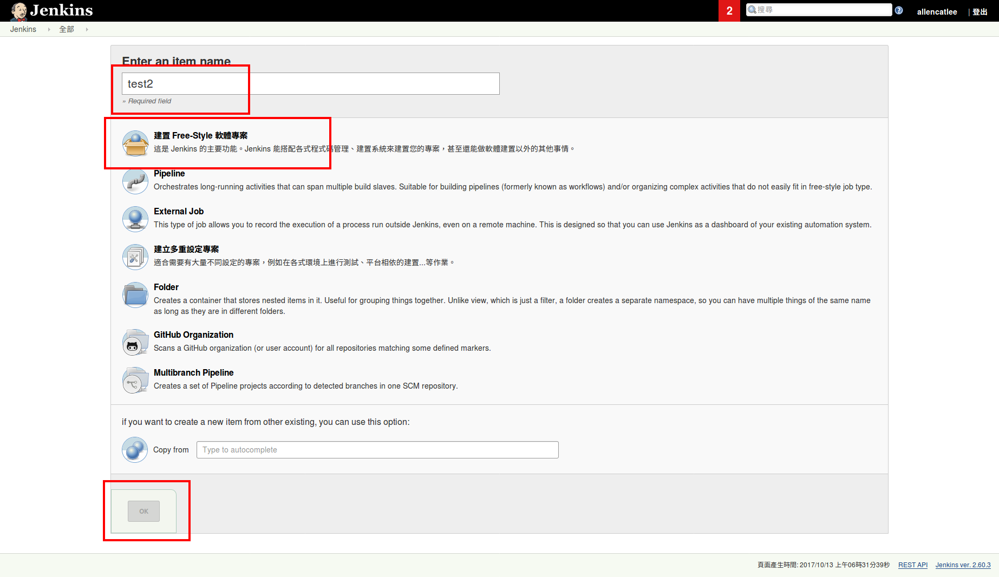
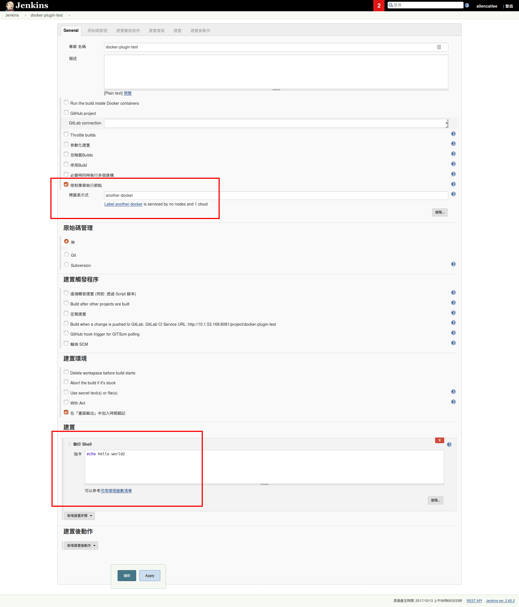
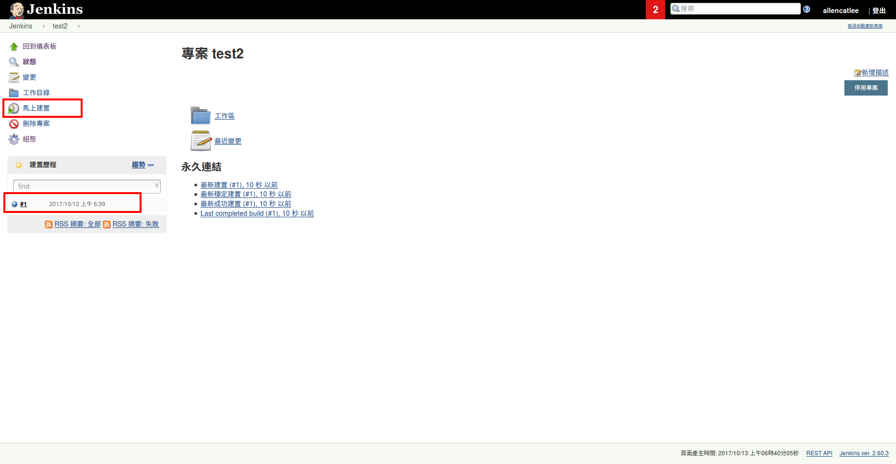
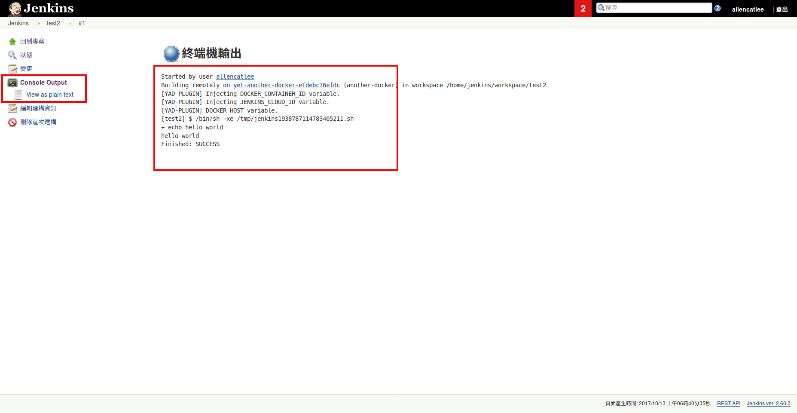
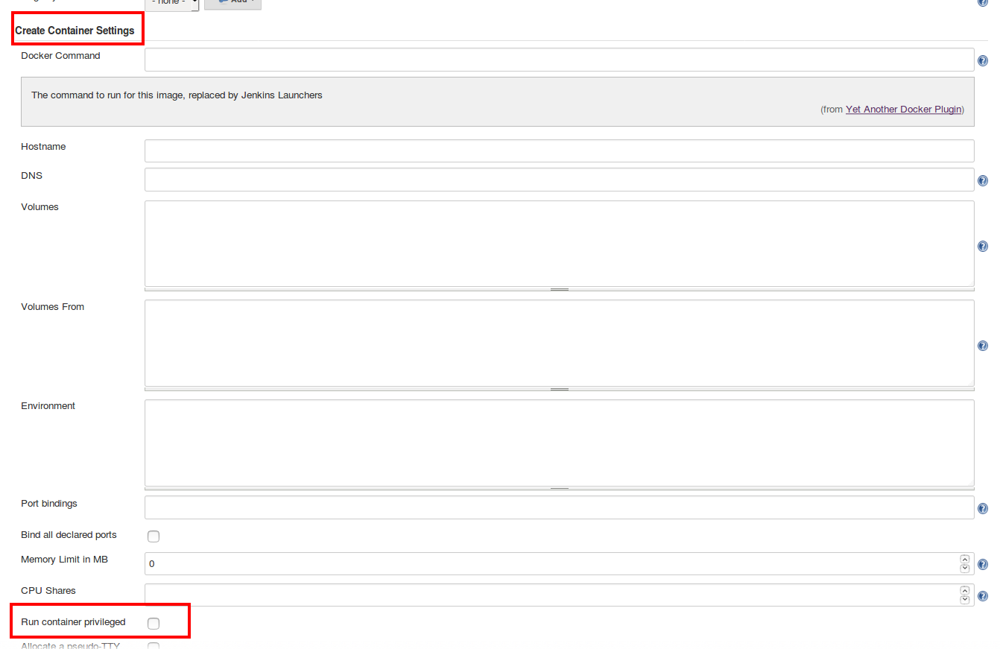

# CI with Jenkins

Jenkins 的設定截圖，參考一下

1. 到管理Jenkins>系統設定>新增雲>Yet Another Docker

2. 在 Yet Another Docker 面板輸入Docker 所在URL ([localhost:4243](http://localhost:4243)) (這部份需要設定啟動 Docker API) 參考以下script

    ```shell
    ######################
    # enable docker api for jenkins CI use
    # Enabling Docker Remote API on Ubuntu 16.04 – The Blog of Ivan Krizsan
    # [https://www.ivankrizsan.se/2016/05/18/enabling-docker-remote-api-on-ubuntu-16-04/](https://www.ivankrizsan.se/2016/05/18/enabling-docker-remote-api-on-ubuntu-16-04/)
    # test: curl [http://localhost:4243/version](http://localhost:4243/version)
    # test2: curl -X GET [http://192.168.5.5:4243/images/json](http://192.168.5.5:4243/images/json)
    ######################
    sudo sed -i '/ExecStart=\\/usr\\/bin\\/docker*/ c\\ExecStart=\\/usr\\/bin\\/dockerd\\/ -H fd:\\/\\/ -H tcp:\\/\\/[0.0.0.0:4243](http://0.0.0.0:4243)\\/' /lib/systemd/system/docker.service
    systemctl daemon-reload
    sudo service docker restart
    ```

3. Image name 填上 `evarga/jenkins-slave` (目前只有測過這個image是可用的，但這個image裡面是ubuntu，所以要參考一下他的dockerfile，改寫成其他OS對應的套件，再build一個新的image出來)

    [evarga/jenkins-slave - Docker Hub](https://hub.docker.com/r/evarga/jenkins-slave/~/dockerfile/)

4. label 可隨便填，之後會用到(這裡填another-docker)

5. launch method 選 Docker SSH computer launcher，credential 填登入image的帳號密碼(那個image的設定是 jenkins:jenkins)

    

6. 主畫面選擇 新增作業

    

7. 輸入專案名稱，選擇建置Free-Style 軟體專案，按ok

    


8. 限制執行節點 填入 another-docker，在執行shell 中填入`echo hello world`

    

9. 按下 馬上建置，過一陣子建置歷程中會出現一條紀錄，點進去可以看見內容

    

10. 點入Console Output 可以看見 執行結果，這個結果表示在該docker image 中執行echo hello world 成功

    這表示可以執行任何command，可以執行git clone XXX 把 code 抓下來，也可以透過 gitlab-plugin 作到這件事

    [jenkinsci/gitlab-plugin: A Jenkins plugin for interfacing with GitLab](https://github.com/jenkinsci/gitlab-plugin)

    如果失敗的話就會return error code，這裡的狀態就會顯示錯誤

    

11. 如果需要build 完可以直接燒到機台上的話，可能要修改docker run 的設定，加上 `--privileged` 參數 應該就可以access NVMe device

    這樣就可以執行燒錄，或其他的測試 script，中間如果發生任何意外中斷的話，就會直接 return failed

    (可以在所有的測試機台上安裝docker client，在 Yet Another Docker 的地方選擇 Add Docker Template，輸入測試機台的url，就可在所有機台上進行自動測試，但windows 可能還沒辦法，主要原因是windows 的docker client 是跑在虛擬機中，沒有辦法access real HW，也許未來會支援吧，可以關注一下)

    
